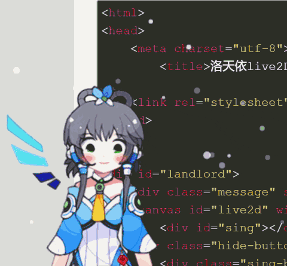

[](https://www.jsdelivr.com/package/gh/x66ccff/lty-lv2d-v3)



## File description
### bundle.js
### live2dcubismcore.js
These two are key configuration files for moc3(live2d-v3 version model), introduced in html

### Hiyori folder
Store the Luotianyi model
(Although the name is Hiyori(an official model name for live2d), the model is Tianyi and borrows Hiyori's actions and expressions, in order to prevent possible bugs, the model name is not changed)

### html part of key code
```
<!-- Live2DCubismCore script -->
<script src="https://blog-static.cnblogs.com/files/yourname/live2dcubismcore.js"></script>
<!-- Build script -->
<script src="https://blog-static.cnblogs.com/files/yourname/bundle.js"></script>
<canvas id="live2d" width="500" height="500" class="live2d" style="position: fixed; opacity: 1; left: -110px; bottom: -125px; z-index: 99999; pointer-events: none;"></canvas>

<script type="text/javascript">
  var resourcesPath = 'https://cdn.jsdelivr.net/gh/x66ccff/lty-lv2d-v3@v1.2/'; 
  var backImageName = ''; 
  var modelDir = ['Hiyori']; 
  initDefine(resourcesPath, backImageName, modelDir); 
</script>
```
